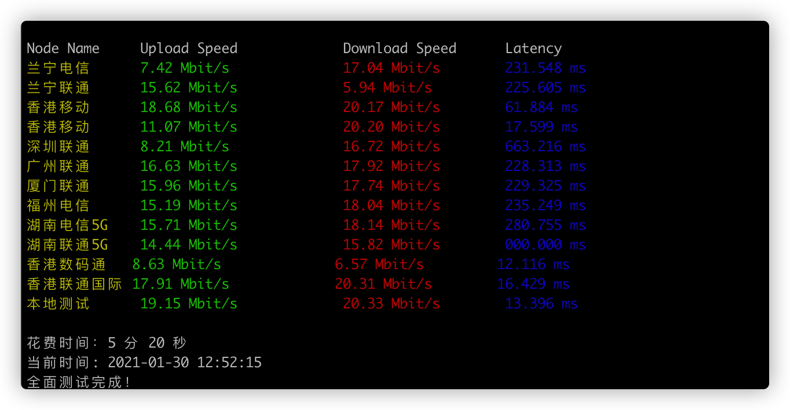

# 用法
## 支持
目前支持自动安装python和wget的系统 Centos 和 Ubuntu
> Mac 系统需自己安装wget  
> 其他系统需自行安装 wget和python  

## 使用
```
wget https://raw.githubusercontent.com/0xIsR00kie/speedtest/master/speedtest.sh
chmod a+x speedtest.sh
sudo ./speedtest.sh
```


